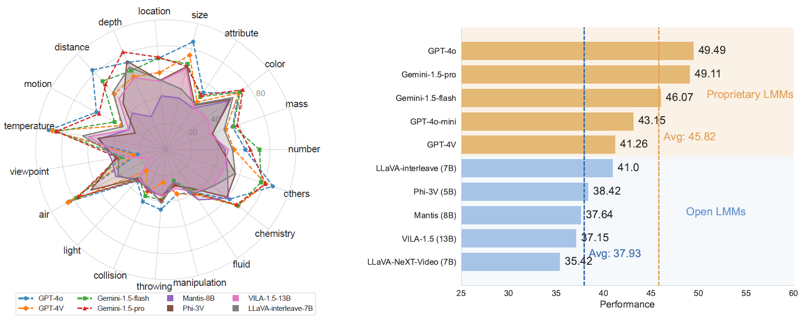
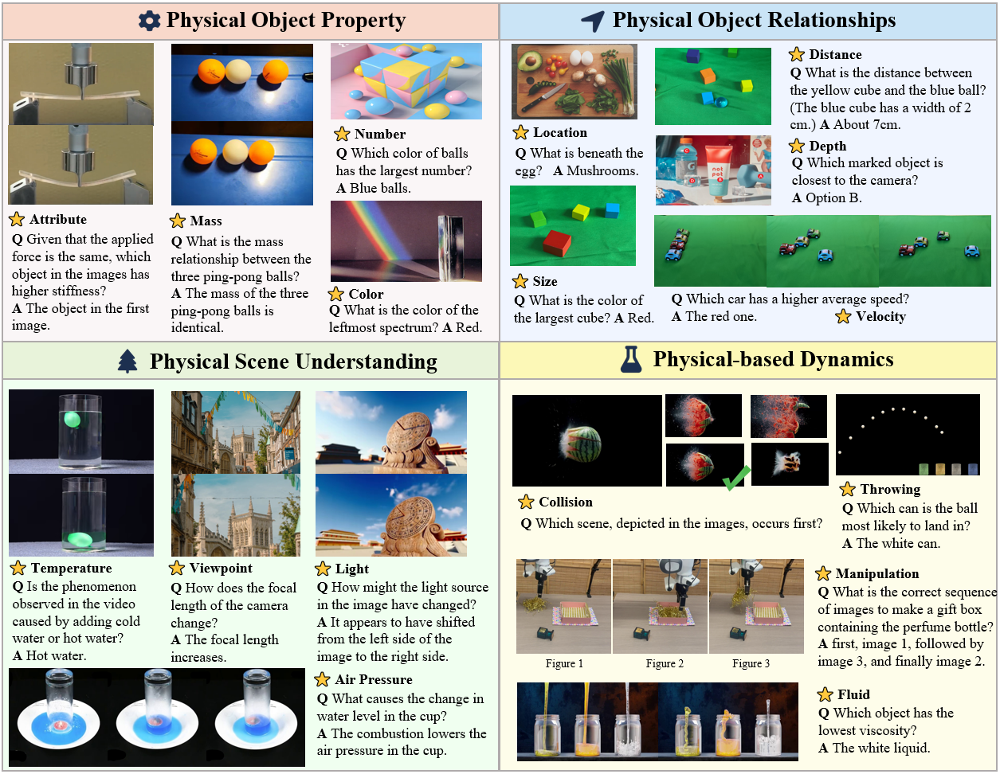
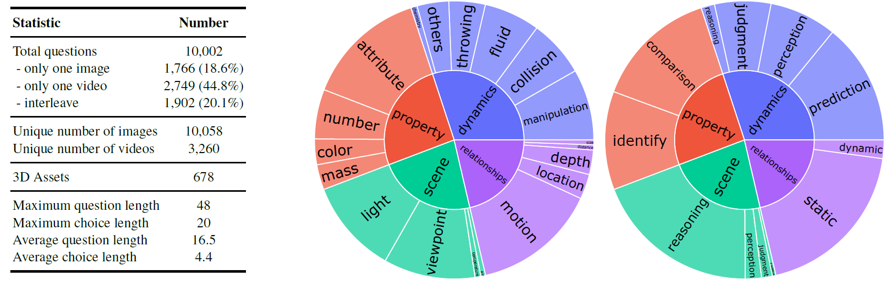
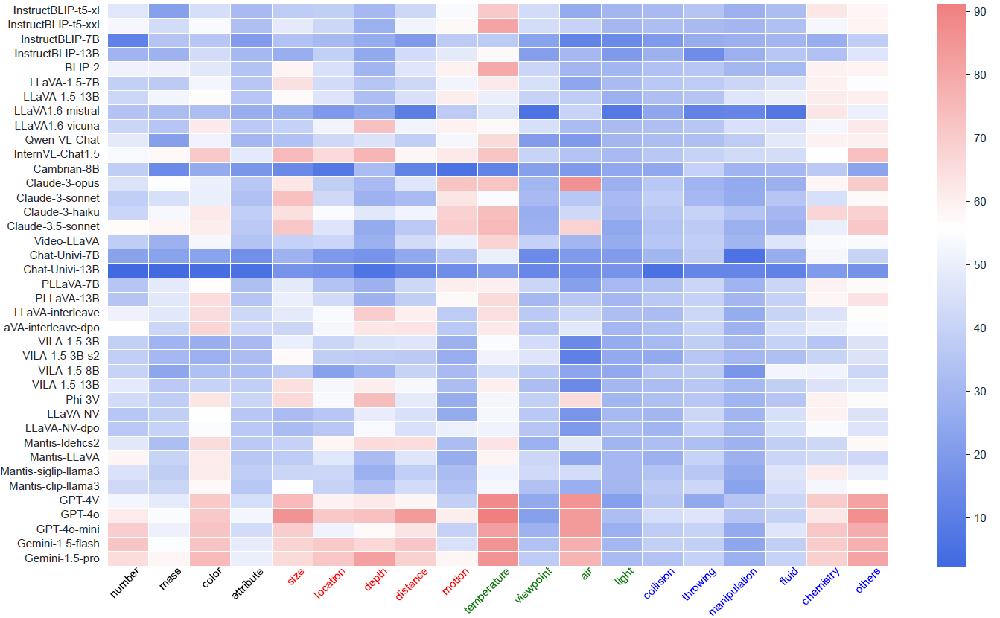

<div align="center">
<h1>  PhysBench </h1>
</div>
<h5 align="center">
    <a href="https://physbench.github.io/">🌐 Homepage</a> | <a href="https://huggingface.co/datasets/USC-GVL/PhysBench">🤗 Dataset</a> | <a href="todo">📑 Paper</a> | <a href="https://github.com/USC-GVL/PhysBench/tree/main/eval">💻 Code</a> | <a href="https://eval.ai/web/challenges/challenge-page/2384/overview">🔺 EvalAI</a>
</h5>


This repo contains evaluation code for the paper "[PhysBench: Benchmarking and Enhancing VLMs for Physical World Understanding](todo)"
If you like our project, please give us a star ⭐ on GitHub for latest update.




## 🔔News

 **🔥[2024-09-23]: Evaluation for test set is now available on [EvalAI](todo). We welcome all submissions and look forward to your participation!**

 **🔥[2024-12-23]: We have added results for 35 new VLMs to the original 39 VLMs, for a total of 74 VLMs are tested!**

We will be releasing the training split of the dataset, 3D assets and the remaining code in the near future.

## Introduction
**Vision-Language Models (VLMs)** have emerged as promising tools for building **embodied agents**, whereas their lack of **physical world understanding** hampers their effectiveness in real-world applications. To address this challenge, we present **PhysBench**, a comprehensive benchmark designed to evaluate and enhance VLMs' understanding of the physical world across diverse and complex tasks.

PhysBench comprises **100,000 entries** of interleaved video-image-text data, and the data is categorized into four major classes: **physical object properties**, **physical object relationships**, **physical scene understanding**, and **physics-driven dynamics**, covering **19 subclasses** and **10 distinct capability dimensions**.

Our extensive experiments on 39 representative VLMs reveal significant gaps in physical world understanding, likely due to the absence of physical knowledge in their training data. To improve VLMs' physical understanding, we propose an agent-based method called **PhysAgent**, which leverages prior physical knowledge and expert model assistance to enhance physical world understanding capabilities.

Furthermore, we demonstrate that improving VLMs’ understanding of the physical world can significantly facilitate the deployment of embodied agents in real-world scenarios, moving towards bridging the gap between human and machine intelligence in comprehending the physical world.


## Dataset Summary

The complete **PhysBench** dataset consists of 100,000 entries, organized into 19 subclasses and 10 distinct capability dimensions. For convenience, we selected a subset of 10,002 entries, which are more challenging and diverse, as the test set, and 200 entries as the validation set for parameter choosing.

- **val**: 200 examples used for model development, validation, or for those with limited computing resources.
- **test**: 10,002 examples for standard evaluation (include val). Notably, the answer labels for test will NOT be publicly released. 
- **train**: The remaining 89,998 examples.



## Evaluation

We have released the **dataset** on Hugging Face [**🤗 Dataset**](https://huggingface.co/datasets/BLINK-Benchmark/BLINK), and you can use the **evaluation tool** in the [eval](eval) folder to reproduce the results from the paper or to explore the performance of your own model !



## 🏆 Leaderboard

This is a subset of the leaderboard for the PhysBench test set. For the complete leaderboard, please refer to the [**🌐 Homepage**](https://physbench.github.io/).

You can submit your model’s predictions for the **test set** on **[EvalAI](https://eval.ai/web/challenges/challenge-page/2287/overview)**.

| **#** | **Model**             | **ALL**   | **object** | **spatial** | **environment** | **phenomena** |
| ----- | --------------------- | --------- | ---------- | ----------- | --------------- | ------------- |
| -     | **Human Performance** | **95.87** | 97.10      | 95.67       | 94.91           | 95.68         |
| 1     | **InternVL2.5-38B 🥇** | **51.94** | 58.77      | 67.51       | 39.04           | 45.00         |
| 2     | **InternVL2.5-78B 🥈** | **51.16** | 60.32      | 62.13       | 37.32           | 46.11         |
| 3     | **GPT-4o 🥉**          | **49.49** | 56.91      | 64.80       | 30.15           | 46.99         |
| 4     | Gemini-1.5-pro        | **49.11** | 57.26      | 63.61       | 36.52           | 41.56         |
| 5     | InternVL2.5-26B       | **48.56** | 59.08      | 58.33       | 36.61           | 41.79         |
| 6     | NVILA-15B             | **46.91** | 59.16      | 42.34       | 38.78           | 45.72         |
| 7     | InternVL2-76B         | **46.77** | 57.65      | 52.43       | 38.07           | 40.12         |
| 8     | Gemini-1.5-flash      | **46.07** | 57.41      | 52.24       | 34.32           | 40.93         |
| 9     | InternVL2-40B         | **45.66** | 55.79      | 50.05       | 35.86           | 41.33         |
| 10    | NVILA-Lite-15B        | **44.93** | 55.44      | 40.15       | 38.11           | 44.38         |
| 11    | InternVL2.5-8B        | **43.88** | 55.87      | 48.67       | 29.35           | 41.20         |
| 12    | NVILA-8B              | **43.82** | 55.79      | 40.29       | 33.95           | 43.43         |
| 13    | InternVL2-26B         | **43.50** | 51.92      | 45.20       | 37.94           | 39.34         |
| 14    | GPT-4o-mini           | **43.15** | 53.54      | 44.24       | 30.59           | 42.90         |
| 15    | mPLUG-Owl3-7B         | **42.83** | 49.25      | 45.62       | 35.90           | 40.61         |
| 16 | NVILA-Lite-8B | **42.55** | 53.81 | 39.25 | 34.62 | 41.17 |
| 17 | InternVL2.5-4B | **42.44** | 51.03 | 44.77 | 31.34 | 41.79 |
| 18 | GPT-4V | **41.26** | 49.59 | 45.77 | 26.34 | 42.15 |
| 19 | LLaVA-interleave | **41.00** | 47.23 | 44.62 | 35.64 | 37.21 |
| 20 | LLaVA-interleave-dpo | **40.83** | 47.97 | 42.67 | 33.73 | 38.78 |
| 21 | InternVL2-8B | **40.00** | 49.05 | 43.58 | 27.05 | 39.47 |
| 22 | Phi-3.5V | **39.75** | 45.72 | 40.15 | 33.02 | 39.40 |
| 23 | InternVL2-4B | **39.71** | 47.12 | 39.96 | 30.94 | 39.76 |
| 24 | InternVL2.5-2B | **39.22** | 49.63 | 38.15 | 29.44 | 38.39 |
| 25 | Phi-3V | **38.42** | 43.67 | 37.92 | 34.93 | 36.92 |
| 26 | Mantis-siglip-llama3 | **37.64** | 42.47 | 32.78 | 36.83 | 37.51 |
| 27 | LLaVA-NV-dpo | **37.43** | 38.83 | 44.31 | 33.86 | 37.21 |
| 28 | Mantis-Idefics2 | **37.39** | 41.97 | 41.44 | 29.53 | 36.56 |
| 29 | VILA-1.5-13B | **37.15** | 40.53 | 40.15 | 31.96 | 36.07 |
| 30 | Mantis-clip-llama3 | **36.92** | 40.61 | 35.11 | 32.45 | 38.36 |
| 31 | Mantis-LLaVA | **36.69** | 44.48 | 30.45 | 36.25 | 34.73 |
| 32 | InternVL2-2B | **36.57** | 44.17 | 35.06 | 30.54 | 35.64 |
| 33 | InternVL2.5-1B | **36.15** | 44.25 | 33.30 | 26.87 | 38.13 |
| 34 | LLaVA-NV | **35.42** | 38.33 | 30.83 | 34.00 | 37.17 |
| 35 | mPLUG-Owl3-2B | **34.87** | 40.92 | 35.11 | 26.69 | 35.64 |
| 36 | VILA-1.5-3B | **34.11** | 32.40 | 33.02 | 34.84 | 35.78 |
| 37 | VILA-1.5-3B-s2 | **33.07** | 33.14 | 30.26 | 35.72 | 33.00 |
| 38 | VILA-1.5-8B | **32.85** | 33.41 | 29.88 | 30.85 | 35.91 |
| 39 | InternVL2-1B | **32.35** | 37.05 | 33.06 | 22.84 | 34.92 |
| 40 | mPLUG-Owl3-1B | **31.68** | 38.02 | 31.54 | 21.87 | 33.00 |
## Disclaimers

Some of the data in PhysBench has been annotated based on existing datasets, as noted in the appendix of the paper. For the forensics detection task, we manually collected images that are publicly available through online searches. We have made every effort to comply with applicable copyright laws and ensure proper attribution of the images used in this paper. However, if you are the copyright holder of any image included in our work and believe its use conflicts with your licensing agreements, please [contact](#contact) us directly. We are committed to promptly addressing any legitimate concerns.

## Contact
- Wei Chow: xieqiao@zju.edu.cn
- Jiageng Mao:  jiagengm@usc.edu
- Yue Wang:   yue.w@usc.edu

### Acknowledgements

Our evaluation code implementation was partially inspired by [TaskMeAnything](https://github.com/JieyuZ2/TaskMeAnything).

## Citation

**BibTeX:**
```bibtex
@article{

}
```
